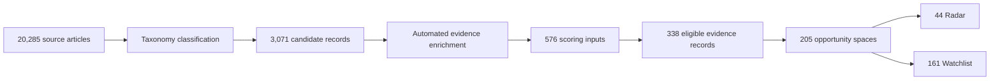
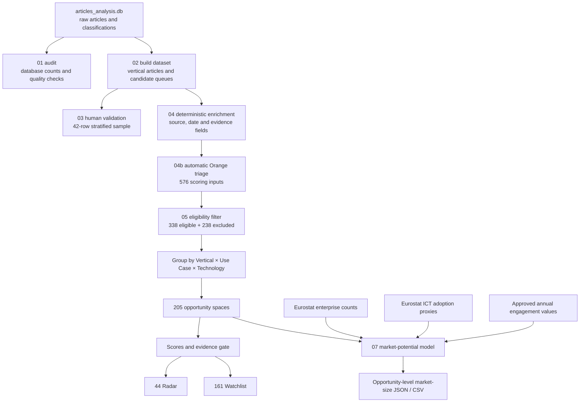

# Business Analysis Guide — Orange Business Innovation Radar

## Purpose of this document

This document helps a junior business analyst understand, explain, challenge,
and present the Innovation Radar to Orange Business stakeholders.

The central business question is:

> How can Orange Business identify external market signals, convert them into
> specific opportunity hypotheses, and decide which opportunities deserve
> further investigation?

The radar is a **decision-support system**. It is not an automatic investment
decision, a revenue forecast, or a replacement for Orange Business experts.

---

## Executive summary

The radar collects external evidence and structures it into:

```text
Opportunity space = Vertical × Use Case × Technology
```

For example:

```text
Public/Gov sector × compliance monitoring × cybersecurity platform
```

Each opportunity is assessed through separate decision lenses:

```text
Attractiveness = strength of external market evidence
Orange fit     = provisional alignment with Orange Business capabilities
Confidence     = strength and independence of the evidence
Urgency        = presence of near-term triggers
Market size    = estimated annual addressable potential, when inputs are validated
```

These concepts are not directly observable. The MVP **operationalizes** them
through measurable evidence:

| Concept | Evidence currently measured | Operational interpretation |
|---|---|---|
| Attractiveness | Signal type, distinct sources, source-quality prior and distinct events | Breadth and strength of observable external activity |
| Orange fit | Distinct Orange-relevant capability groups found in the evidence | Breadth of plausible capability alignment |
| Confidence | Evidence-record count, average source quality and distinct sources | Degree of evidence triangulation supporting the conclusion |
| Urgency | Proportion of regulation, buying-signal and market-move records | Density of action-triggering evidence |
| Market potential | Enterprise population, adoption scenario and approved annual engagement value | Scenario-based annual addressable service potential |

These are **proxy measurements**, not direct observations of customer demand,
Orange win probability, or future revenue. The interpretation must always follow
the evidence actually measured.

The system currently produces 205 opportunity spaces from 338 eligible evidence
records. Forty-four spaces pass the Radar publication gate and 161 remain on the
Watchlist. Market-size records exist for all 205 spaces, but EUR values are
currently withheld because annual engagement-value assumptions have not yet been
approved.

---

# 1. What a junior business analyst should understand

## 1.1 Understand the business problem before the technology

Orange Business operates in a market with too much fragmented information:

- new regulations;
- procurement notices;
- technology announcements;
- competitor moves;
- research programmes;
- partnerships and deployments; and
- news articles of mixed quality.

The business problem is not simply “finding articles.” The problem is deciding:

1. Which signals represent a meaningful customer problem?
2. Which combinations could become business opportunities?
3. Which opportunities are plausible for Orange Business?
4. Which conclusions have enough independent evidence?
5. What should an innovation team investigate first?

## 1.2 Understand the three-dimensional opportunity model

### Vertical

The customer’s industry context, such as:

- Manufacturing;
- Healthcare;
- Automotive;
- Energy;
- Finance, Banking and Insurance;
- Public/Government sector;
- Defense;
- Retail; and
- Aerospace.

### Use case

The business problem or operational outcome, such as:

- compliance monitoring;
- predictive maintenance;
- asset tracking;
- anomaly detection;
- energy optimization;
- warehouse automation; and
- environmental-emissions monitoring.

### Technology

The enabling technical capability, such as:

- cybersecurity platforms;
- IoT platforms;
- machine learning;
- cloud data platforms;
- digital twins;
- computer vision; and
- autonomous vehicles or drones.

The opportunity is the intersection, not one dimension alone. “AI is growing”
is a trend. “Healthcare × diagnostic support × machine learning” is an
opportunity hypothesis that can be investigated.

## 1.3 Understand the evidence journey

The main analytical flow is:



Important: these stages use different populations. Do not present 20,285 raw
articles as if all of them directly support the 205 final opportunities.

## 1.4 Understand what every score means

| Measure          | Business question                                              | Meaning                                                                    | Not equivalent to          |
| ---------------- | -------------------------------------------------------------- | -------------------------------------------------------------------------- | -------------------------- |
| Attractiveness   | Is the external market showing meaningful action?              | Signal strength, source independence, source quality and evidence momentum | Market revenue             |
| Orange fit       | Could Orange Business plausibly provide relevant capabilities? | Breadth of matched capability groups                                       | Probability of winning     |
| Confidence       | How much should we trust the conclusion?                       | Evidence volume, quality and independence                                  | Commercial value           |
| Urgency          | Is there a time-sensitive trigger?                             | Share of regulation, procurement and market-move signals                   | Long-term growth           |
| Priority         | What should analysts inspect first?                            | Weighted synthesis of the four scores                                      | ROI or success probability |
| Market potential | What could the annual addressable economic scale be?           | Enterprise base × demand rate × annual engagement value                  | Guaranteed Orange revenue  |

The current priority formula is:

```text
Priority = 40% Attractiveness
         + 35% Orange fit
         + 15% Confidence
         + 10% Urgency
```

These are transparent MVP business weights. They were not learned as causal
coefficients from historical Orange sales outcomes.

## 1.5 Understand Radar versus Watchlist

An opportunity reaches the Radar only when it has:

```text
at least 2 independent events
at least 2 independent source groups
confidence >= 45
```

A Watchlist result is not necessarily a bad opportunity. It means the current
evidence is too limited, too dependent, or too uncertain for stronger
publication.

This distinction protects stakeholders from false confidence.

## 1.6 Understand Orange fit versus right-to-win

Orange fit asks whether the opportunity matches capabilities Orange Business
could plausibly provide, such as connectivity, cloud/edge, cybersecurity,
data/AI, and integration.

Right-to-win is a more demanding strategic concept:

```text
Right-to-win = capability fit
             + credentials and customer references
             + delivery reach
             + partner ecosystem
             + differentiation
             - competitor strength
```

The current model has a **provisional Orange-fit score**. It does not yet have a
complete, Orange-approved right-to-win score.

## 1.7 Understand the market-potential calculation

Market potential is calculated independently from article scoring.

For enterprise population `N` and technology-adoption rate `a`:

```text
Greenfield enterprises = N × (1 − a)
Expansion / managed-service enterprises = N × a
```

For each scenario:

```text
Annual addressable potential = addressable enterprises
                             × approved annual engagement value in EUR
```

The model uses:

- Eurostat enterprise counts;
- Eurostat technology-adoption proxies;
- low, central and high annual engagement values; and
- country coverage and validation rules.

The stakeholder-safe description is:

> Estimated annual addressable service potential under stated public-data and
> annual-value assumptions.

Currently, all 205 records are `pending_or_unavailable` because annual
engagement-value assumptions have not been approved. This is controlled
incompleteness, not a calculation failure.

## 1.8 Understand the role of AI

AI can help:

- classify and summarize text;
- extract possible signals;
- explain an opportunity;
- generate a stakeholder report; and
- suggest areas requiring review.

Deterministic code should:

- calculate scores;
- enforce thresholds;
- remove duplicates;
- validate numeric inputs;
- aggregate market potential; and
- prevent invalid EUR values from reaching the UX.

The design principle is:

> AI interprets language; deterministic code calculates and validates numbers.

## 1.9 Understand the analyst’s role

A business analyst contributes by:

1. defining terms such as relevance, opportunity, attractiveness and fit;
2. translating stakeholder needs into acceptance criteria;
3. validating whether model outputs make business sense;
4. separating facts, assumptions and proxies;
5. documenting limitations and evidence gaps;
6. identifying which sources or verticals are underrepresented;
7. supporting scoring-weight workshops;
8. designing stakeholder-friendly explanations;
9. testing whether the UX answers real decisions; and
10. preventing technical outputs from becoming unsupported commercial claims.

---

# 2. Project scope to introduce to Orange Business

## 2.1 Recommended scope statement

> The Innovation Radar is an external market-intelligence MVP that collects and
> structures public evidence, identifies Vertical × Use Case × Technology
> opportunity spaces, prioritizes them through transparent scoring, and presents
> the evidence and uncertainty in a decision-oriented interface.

## 2.2 Current MVP scope

### In scope

- External and public market-intelligence sources.
- Fourteen vertical taxonomies.
- Use-case and technology classification.
- Evidence enrichment and source-quality handling.
- Orange-addressability hypotheses.
- Attractiveness, provisional Orange fit, confidence and urgency.
- Radar and Watchlist separation.
- Evidence traceability and exclusion reasons.
- Europe-level market-potential architecture.
- Regional and country coverage metadata.
- Structured CSV/JSON outputs for Beta-app integration.
- AI-supported explanation and report generation using deterministic facts.

### Current geographic scope

Country-level inputs aggregate to the configured Orange Business Europe view:

- France;
- Benelux;
- Germany;
- Southern Europe;
- DACH;
- UK and Ireland;
- Nordics; and
- provisional Eastern Europe.

The opportunity remains defined by vertical, use case and technology. Geography
is a market-calculation and drill-down layer.

## 2.3 Out of scope for the current MVP

- Guaranteed sales or revenue forecasts.
- A complete Orange-approved right-to-win model.
- Automatic investment or go-to-market decisions.
- Perfect coverage of every country, vertical and emerging technology.
- Paid proprietary market-research datasets.
- Internal Orange customer, pipeline, margin or win/loss data.
- Causal proof that an external signal will create revenue.
- Fully validated EUR estimates for all opportunity spaces.
- Fully autonomous operation without expert review or governance.

## 2.4 Proposed next-phase scope

1. Validate annual engagement values for five to ten high-priority spaces.
2. Integrate market-size records into the final Beta-app opportunity page.
3. Add Orange-approved capabilities, credentials and customer references.
4. Add competitor evidence to build a fuller right-to-win model.
5. Improve source coverage for selected strategic verticals.
6. Run sensitivity tests on weights and thresholds.
7. Establish ownership, review cadence and model governance.
8. Measure whether recommendations lead to analyst action or business discovery.

## 2.5 Stakeholder value proposition

The project helps Orange Business move from:

| Current challenge             | Radar contribution                               |
| ----------------------------- | ------------------------------------------------ |
| Fragmented market information | One structured opportunity view                  |
| Generic trend reports         | Specific vertical/use-case/technology hypotheses |
| Subjective prioritization     | Transparent and adjustable scoring               |
| Repeated or dependent sources | Independence and duplicate controls              |
| Unclear evidence quality      | Confidence and traceable sources                 |
| Too many weak ideas           | Radar and Watchlist separation                   |
| Unsupported financial claims  | Validated market-potential safety gates          |
| One-off analysis              | Reusable and refreshable pipeline                |

---

# 3. Selling points and strengths of the radar

## Selling point 1 — It produces actionable opportunity spaces

The radar does not merely show that a technology is popular. It connects:

```text
who has the problem × what outcome is needed × which technology enables it
```

This creates a stronger starting point for innovation, consulting, partnership,
and go-to-market discussions.

## Selling point 2 — It separates market promise from Orange relevance

A topic may be attractive but poorly aligned with Orange. Another topic may
match Orange capabilities but have weak external evidence. Keeping these
dimensions separate makes the decision more honest and useful.

## Selling point 3 — It is explainable and auditable

Stakeholders can inspect:

- the supporting evidence;
- the source and date;
- why a record was included or excluded;
- each score component;
- the publication gate; and
- the limitations or missing inputs.

This is stronger than presenting an unexplained LLM score.

## Selling point 4 — It manages uncertainty visibly

The Watchlist prevents weak opportunities from disappearing while avoiding the
claim that every idea is ready for action. Missing market-size assumptions remain
missing instead of becoming invented EUR values.

## Selling point 5 — It reduces information overload

The pipeline converts many records into a smaller, structured portfolio:

```text
576 scoring inputs
→ 338 eligible evidence records
→ 205 opportunity spaces
→ 44 Radar priorities
→ 161 Watchlist hypotheses
```

## Selling point 6 — It controls cost and hallucination risk

AI is used where language interpretation creates value. Reproducible code
handles arithmetic and validation, limiting repeated token use and reducing the
risk of fabricated scores or financial figures.

## Selling point 7 — It is modular and reusable

The opportunity model, company profile, scoring rules, geography configuration,
and UX export are separate components. The same architecture can later support:

- a competitor profile;
- another Orange business unit;
- another client;
- a new vertical; or
- updated weights and sources.

## Selling point 8 — It reveals research gaps

Manufacturing currently has 12 scored spaces but zero Radar spaces. The radar
does not hide this result. It identifies where additional source collection and
validation are required.

## Concise selling statement

> The radar does not rank buzzwords. It ranks traceable, Orange-addressable
> opportunity hypotheses and shows both their potential and their uncertainty.

---

# 4. STAR analysis of the project

## Situation

Orange Business innovation stakeholders face a large and continuously changing
volume of external information. Signals are spread across procurement,
regulation, research, company announcements and news. Manual research is slow,
inconsistent and difficult to compare across verticals. Generic technology
trends also do not automatically identify an Orange-addressable opportunity.

Constraints included:

- no internal Orange sales or customer data;
- reliance on free and public sources;
- inconsistent dates and source quality;
- possible duplication and syndicated coverage;
- limited time and analyst capacity;
- ambiguous concepts such as attractiveness and fit; and
- the risk of AI-generated unsupported conclusions.

## Task

The team needed to create an MVP that could:

1. collect and structure external evidence;
2. classify evidence consistently across verticals;
3. identify specific opportunity spaces;
4. prioritize opportunities transparently;
5. retain evidence and uncertainty;
6. connect results to an interactive UX; and
7. develop a defensible path toward market-potential estimates.

The business-analysis task was to translate ambiguous strategic concepts into
clear definitions, measurable variables, acceptance rules, and stakeholder-safe
language.

## Action

The project team:

- audited the teammate database in read-only mode;
- identified 20,285 articles and 14 verticals;
- created configurable multi-vertical datasets;
- performed a 42-record stratified human-validation pilot;
- measured pilot taxonomy accuracy, precision, recall and F1;
- enriched candidate evidence with signal, source, independence and Orange-fit
  information;
- created deterministic attractiveness, fit, confidence, urgency and priority
  formulas;
- used evidence gates to separate Radar from Watchlist;
- preserved excluded records and reasons;
- prepared Eurostat enterprise and ICT-adoption data;
- separated greenfield from expansion/managed-service demand;
- added low/central/high market-potential validation;
- produced Beta-app-ready CSV and JSON exports; and
- documented limitations, assumptions and presentation language.

## Result

Verified current results include:

- 576 scoring input records;
- 338 eligible evidence records;
- 238 traceable exclusions;
- 205 opportunity spaces;
- 44 Radar spaces;
- 161 Watchlist spaces;
- a 43.2 median priority score; and
- 205 opportunity-level market-size records ready for integration.

The 42-record taxonomy-validation pilot produced:

- 92.0% accuracy;
- 84.6% relevant precision;
- 100.0% relevant recall; and
- 91.7% relevant F1.

These validation figures describe a small stratified pilot, not guaranteed
accuracy across the full corpus. They validate taxonomy relevance, not final
Orange commercial relevance.

The market-size records currently suppress EUR values because annual engagement
assumptions remain unapproved. This demonstrates that the validation gate works,
but financial validation is still required before stakeholder publication.

## STAR version for a 90-second presentation

> **Situation:** Orange Business must detect innovation opportunities from a
> fragmented and rapidly changing external information environment. Manual
> research is difficult to scale, while generic trends do not show a concrete
> Orange role.
>
> **Task:** We needed to transform public signals into specific, comparable and
> explainable opportunity spaces without internal Orange data or paid market
> reports.
>
> **Action:** We structured each opportunity as Vertical × Use Case × Technology,
> separated attractiveness, Orange fit, confidence and urgency, introduced
> Radar/Watchlist evidence gates, and built a validated public-data market-
> potential pipeline for future UX integration.
>
> **Result:** The current pipeline converts 338 eligible evidence records into
> 205 opportunity spaces. Forty-four pass the Radar gate, while 161 remain on a
> transparent Watchlist. The system also exposes research gaps and blocks
> unsupported EUR estimates rather than inventing them.

---

# 5. Preparing for the Head of Innovation

## 5.1 Understand the stakeholder’s likely priorities

A Head of Innovation is likely to care about:

- strategic relevance;
- speed from signal to decision;
- evidence quality;
- differentiation from existing tools;
- adoption by innovation and business teams;
- governance and trust;
- integration with current workflows;
- measurable business outcomes;
- scalability and operating cost; and
- what decision or action the product enables next.

They may care less about the names of Python scripts. Translate technical work
into decisions, risk controls and business outcomes.

## 5.2 Questions to ask before selling

Use a discovery approach. Ask questions such as:

1. Which innovation decisions currently take the most research time?
2. How do you currently identify and compare opportunity spaces?
3. Which teams consume innovation intelligence: strategy, sales, consulting,
   presales, partnerships, or product management?
4. Which verticals and regions are strategically most important?
5. What evidence is required before an opportunity enters the official radar?
6. How should Orange capability fit be validated internally?
7. What would make an opportunity actionable: a report, named accounts, partner
   targets, procurement evidence, or market-potential range?
8. Which internal documents could improve right-to-win without exposing
   sensitive customer data?
9. What update cadence would be useful?
10. How should success be measured after a three-month pilot?

These questions turn the meeting into joint problem definition instead of a
one-directional product pitch.

## 5.3 Expected stakeholder questions and preparation

| Expected question                            | Why they may ask                       | Prepared response                                                                                                                      | Evidence to show                               |
| -------------------------------------------- | -------------------------------------- | -------------------------------------------------------------------------------------------------------------------------------------- | ---------------------------------------------- |
| What decision does this help me make?        | They need strategic usefulness         | It prioritizes which opportunity hypotheses deserve expert validation, sourcing or go-to-market exploration                            | Radar/Watchlist view and opportunity detail    |
| How is this different from a news dashboard? | They may already have monitoring tools | It structures signals into vertical/use-case/technology opportunities and separates attractiveness, Orange fit, confidence and urgency | Opportunity model and scoring components       |
| Why should I trust the scores?               | Scoring can look subjective            | The rules and weights are explicit, bounded and traceable; confidence is separated from priority                                       | Formula, evidence records and publication gate |
| Is the score a probability of winning?       | `81/100` may be misunderstood        | No. It is a priority index, not a probability, ROI or sales forecast                                                                   | Score definition slide                         |
| How is Orange fit calculated?                | They will test strategic relevance     | It currently measures provisional capability-group coverage; an Orange-approved capability map is the next validation step             | Capability groups and limitation statement     |
| Do we really have right-to-win?              | Fit alone is insufficient              | Not yet. Right-to-win needs credentials, references, delivery reach, differentiation and competitor evidence                           | Proposed right-to-win framework                |
| How accurate is classification?              | They need evidence of quality          | The 42-record pilot produced 92% accuracy and 91.7% F1, but it is a small taxonomy pilot and requires continued validation             | Confusion matrix and sample design             |
| Are sources independent?                     | Syndication can inflate trends         | The pipeline counts source groups and events rather than relying only on article volume                                                | Evidence and independence fields               |
| What happens when data is missing?           | They want governance                   | The system shows Watchlist or unavailable status; it does not silently replace missing evidence with zero or AI-generated facts        | Market-size status and validation report       |
| Where does the market-size number come from? | EUR values attract scrutiny            | Enterprise population × adoption scenario × approved annual engagement value, with low/central/high scenarios                        | Eurostat sources and formula                   |
| Why is no EUR value visible yet?             | Current UX may show unavailable        | Commercial assumptions are not approved; safety gates correctly suppress unsupported values                                            | `pending_or_unavailable` status              |
| Is this TAM?                                 | Market terminology is sensitive        | It is an annual addressable service-potential scenario for one opportunity, not generic industry turnover                              | Scope and assumptions                          |
| Can this cover all verticals?                | They want scalability                  | The pipeline supports 14 verticals through configuration, but evidence quality and market mappings vary                                | Multi-vertical outputs and coverage gaps       |
| Why does Manufacturing have no Radar result? | Manufacturing was an early focus       | Current sources do not provide enough independent evidence under the gate; this is a research gap, not no opportunity                  | 12 scored / 0 Radar result                     |
| How often can it refresh?                    | Innovation intelligence becomes stale  | The architecture is refreshable; production cadence and source ownership must be agreed                                                | Pipeline and proposed operating model          |
| How much does the AI cost?                   | They care about scalability            | AI handles text tasks while deterministic code handles repeated arithmetic and validation; usage caps and batching can control cost    | Architecture and run configuration             |
| Can the AI hallucinate market values?        | Financial claims create risk           | The AI receives validated structured values and is instructed not to infer missing amounts                                             | Market-size service contract                   |
| Can it connect to our existing systems?      | Adoption requires workflow integration | Outputs are available as stable-keyed JSON/CSV; API and authentication design remain next-phase work                                   | Beta-app export schema                         |
| How do we measure business impact?           | A pilot needs success criteria         | Measure time saved, expert acceptance, evidence coverage, decision conversion and follow-up actions                                    | Proposed pilot scorecard                       |

## 5.4 Recommended approach to the Head of Innovation

### Step 1 — Start with their decision problem

Avoid opening with technical architecture. Start with:

> Innovation teams face too many signals and too little time to determine which
> opportunities are specific, credible and relevant to Orange Business.

### Step 2 — Demonstrate one complete opportunity journey

Use one strong example, preferably:

```text
Public/Gov sector × compliance monitoring × cybersecurity platform
```

Show:

1. the opportunity definition;
2. supporting source evidence;
3. attractiveness score;
4. provisional Orange fit;
5. confidence and urgency;
6. why it passes the Radar gate;
7. current market-size status; and
8. the next recommended analyst action.

Do not spend the limited meeting time clicking through every feature.

### Step 3 — Explain the differentiation

Use three messages:

1. **Specific:** opportunity spaces, not broad trends.
2. **Explainable:** separate scores and traceable evidence.
3. **Safe:** uncertainty and missing values remain visible.

### Step 4 — Be transparent about limitations

State before being challenged:

- Orange fit is provisional;
- right-to-win needs internal and competitor evidence;
- market potential is proxy-based;
- annual values still require approval; and
- source depth varies by vertical.

Transparency increases credibility with a senior innovation stakeholder.

### Step 5 — Ask for a focused pilot, not immediate enterprise adoption

Recommended request:

> Select two strategic verticals and five to ten opportunity spaces. Over a
> defined pilot period, Orange experts validate relevance, capability fit,
> annual engagement assumptions and recommended actions. We then measure time
> saved, acceptance rate and business follow-up.

### Step 6 — Agree on success measures

Suggested pilot KPIs:

| KPI                             | Example definition                                                            |
| ------------------------------- | ----------------------------------------------------------------------------- |
| Analyst time saved              | Hours required to produce a comparable opportunity review                     |
| Expert acceptance rate          | Share of Radar opportunities judged strategically relevant                    |
| Precision of Radar publication  | Share of published spaces accepted by experts                                 |
| Evidence coverage               | Independent sources and events per selected opportunity                       |
| Decision conversion             | Opportunities moved to investigation, partnership, account or offering action |
| Market-size validation coverage | Selected opportunities with approved financial assumptions                    |
| Freshness                       | Time between external signal and radar availability                           |
| Cost per refresh                | Data/API/LLM operating cost for one update cycle                              |

## 5.5 Suggested meeting structure

|      Time | Activity                                    | Objective           |
| --------: | ------------------------------------------- | ------------------- |
| 2 minutes | Confirm the innovation-intelligence problem | Establish relevance |
| 3 minutes | Explain evidence-to-opportunity workflow    | Build understanding |
| 5 minutes | Demonstrate one opportunity end to end      | Prove usefulness    |
| 3 minutes | Explain uniqueness and controls             | Build trust         |
| 3 minutes | Discuss limitations and validation needs    | Avoid overclaiming  |
| 4 minutes | Ask discovery questions and agree pilot     | Obtain next action  |

## 5.6 Thirty-second pitch

> Innovation Radar turns fragmented external signals into specific opportunity
> spaces defined by vertical, use case and technology. It ranks them using
> transparent attractiveness, Orange-fit, confidence and urgency measures, while
> keeping every source and uncertainty visible. Instead of asking Orange teams
> to read hundreds of articles, it helps them focus expert attention on the
> opportunities with the strongest current evidence and shows where more
> research is needed.

## 5.7 Two-minute pitch

> Orange Business operates across many technologies, industries and regions, so
> the challenge is not access to information—it is converting scattered signals
> into decisions. Our radar collects public evidence and structures each result
> as a vertical, a business use case and an enabling technology.
>
> We then keep four questions separate. Is the market externally attractive? Is
> there a plausible Orange Business capability fit? Is the evidence sufficiently
> reliable and independent? And is there an urgent trigger? This produces a
> transparent priority index and separates Radar opportunities from Watchlist
> hypotheses.
>
> The current system has identified 205 opportunity spaces, of which 44 pass the
> Radar evidence gate. It also has a controlled market-potential pipeline that
> will show low, central and high annual addressable EUR ranges once the commercial
> assumptions are validated. The result is not an autonomous decision-maker. It
> is a traceable decision-support tool that helps Orange experts focus their
> attention, challenge the evidence and move promising opportunities toward
> action.

---

# 6. How the numbers are produced

## 6.1 Why this section matters

A business analyst should be able to answer three questions for every number:

```text
Where did it come from?
How was it calculated?
What does it prove — and what does it not prove?
```

The radar combines several types of evidence. Database counts, classification
metrics, opportunity scores and market-potential scenarios are produced by
different methods and must not be mixed together.

## 6.2 End-to-end data lineage



## 6.3 Evidence and output files

| Analytical layer    | Primary evidence/input                                             | Method                                                | Main audit output                                    |
| ------------------- | ------------------------------------------------------------------ | ----------------------------------------------------- | ---------------------------------------------------- |
| Database inventory  | `articles_analysis.db`                                           | Read-only SQL counts and integrity checks             | `Analysis/outputs/database_audit.txt`              |
| Vertical datasets   | Database article and classification tables                         | Filter and export by configured vertical              | `Analysis/outputs/<vertical>/articles.csv`         |
| Candidate selection | Classification status                                              | Keep`classified` and `needs_review` candidates    | `candidate_queue.csv` for each vertical            |
| Taxonomy validation | Human labels in a stratified sample                                | Compare pipeline prediction with reviewer label       | `validation_metrics.csv`, `confusion_matrix.csv` |
| Evidence enrichment | Candidate title, summary, classification evidence, source and date | Transparent deterministic rules                       | `enriched_candidates.csv`                          |
| Orange triage       | Explicit capability, signal and non-addressable keyword groups     | Rule-based classification with stored matched terms   | `auto_enriched_candidates.csv`                     |
| Scoring input       | Auto-enriched rows marked ready                                    | Export rows eligible for scoring preparation          | `auto_scoring_candidates.csv`                      |
| Opportunity scoring | Eligible article-level evidence                                    | Group and calculate bounded score components          | `opportunity_scores.csv`                           |
| Evidence trace      | Article records contributing to scored spaces                      | Preserve article and opportunity keys                 | `opportunity_evidence.csv`                         |
| Exclusions          | Ineligible scoring records                                         | Store one or more exclusion reasons                   | `scoring_exclusions.csv`                           |
| Market denominator  | Eurostat Structural Business Statistics                            | Normalize enterprise counts by country, NACE and size | `enterprise_counts_*.csv`                          |
| Adoption proxy      | Eurostat ICT indicators                                            | Normalize percentage to a 0–1 rate                   | `technology_adoption_rates.csv`                    |
| Annual value        | Public comparable contracts plus analyst approval                  | Low/central/high annual-value assumptions             | `annual_engagement_value_assumptions_template.csv` |
| Market potential    | Opportunity, enterprise, adoption and annual-value records         | Scenario multiplication plus validation gates         | `market_potential_scenarios.csv`                   |
| UX export           | Validated scenario records                                         | Join and aggregate by stable opportunity key          | `beta_opportunity_market_sizes.json`               |

## 6.4 How the portfolio counts are obtained

### 20,285 source articles

`01_audit_database.py` opens the teammate SQLite database in read-only mode and
executes SQL counts. The 20,285 figure is the number of records in the source
article table at the time of the audit.

Evidence:

```text
BeCode_dataOrange-radar-research-pipeline/data/articles_analysis.db
Analysis/01_audit_database.py
Analysis/outputs/database_audit.txt
```

This number measures database volume. It does not mean that all 20,285 records
are relevant, independent, current, or used in scoring.

### 3,071 candidate records

`02_build_dataset.py` reads the database and exports each vertical. Candidate
queues retain records whose classification status is `classified` or
`needs_review`. Adding the candidate queues across the 14 verticals produced
3,071 records.

This is a taxonomy candidate population, not 3,071 confirmed Orange
opportunities.

### 576 scoring input records

`04b_auto_enrich_candidates.py` reads `enriched_candidates.csv` and applies
explicit, stored rule dictionaries to the combined:

```text
title
summary
classification_evidence
use_case_id
technology_id
```

It checks:

- Orange-addressable capability groups;
- non-addressable context groups;
- signal-type terms;
- taxonomy completeness;
- date quality; and
- existing pipeline status.

The resulting rows marked `ready_for_scoring` are written to:

```text
Analysis/outputs/enrichment/auto_scoring_candidates.csv
```

The 576 figure is the number of rows in this file during the current scoring
run. The automatic method is a transparent first-pass triage method, not a
replacement for strategic expert review.

### 338 eligible evidence records

`05_score_opportunities.py` applies an additional scoring eligibility gate. A
record is eligible only when all conditions are true:

```text
vertical is present
use_case_id is present
technology_id is present
classification_status = classified
enrichment_status = ready_for_scoring
date_quality_flag = valid_past
```

The number of rows satisfying all conditions is 338.

### 238 excluded records

The same program retains every non-eligible input and assigns one or more
reasons:

```text
incomplete_taxonomy
taxonomy_not_classified
not_ready_for_scoring
date_not_valid_past
```

The arithmetic is:

```text
576 input records − 338 eligible records = 238 excluded records
```

Evidence:

```text
Analysis/outputs/scoring/scoring_exclusions.csv
```

### 205 opportunity spaces

The 338 eligible evidence records are grouped by:

```text
vertical + use_case_id + technology_id
```

Each distinct combination becomes one opportunity space. This grouping produced
205 spaces.

The 205 figure is therefore a count of unique taxonomy combinations supported
by eligible evidence. It is not a count of customers or contracts.

### 44 Radar and 161 Watchlist spaces

For every opportunity, the code counts distinct evidence events, distinct source
names, and calculates confidence. The current publication gate is:

```text
independent_event_count >= 2
independent_source_count >= 2
confidence_score >= 45
```

Forty-four spaces pass all three conditions. The other 161 are written to the
Watchlist:

```text
44 Radar + 161 Watchlist = 205 opportunity spaces
```

### Median priority score of 43.2

The median is the middle priority value after sorting all 205 opportunity
scores. It is used instead of only the mean because it is less sensitive to a
small number of very high or very low scores.

The value `43.2` is a portfolio summary. It is not a percentage probability.

The authoritative summary is:

```text
Analysis/outputs/scoring/scoring_summary.csv
```

## 6.5 Evidence rules used in automatic enrichment

### Orange capability evidence

The automatic enrichment records matched terms under explicit capability
groups:

| Capability group      | Example evidence terms                                                |
| --------------------- | --------------------------------------------------------------------- |
| Connectivity          | 5G, private network, Wi-Fi, satellite, IoT, connected                 |
| Cloud and edge        | Cloud, edge, data platform, data space, sovereignty                   |
| Cybersecurity         | Cyber, security, zero trust, resilience, security operations          |
| Data and AI           | AI, machine learning, analytics, computer vision, digital twin        |
| Industrial operations | Factory, production, plant, warehouse, maintenance                    |
| Business trigger      | Procurement, tender, rollout, investment, pilot, contract, regulation |

The output stores the exact matched groups and terms in fields such as:

```text
auto_positive_groups
auto_negative_groups
auto_matched_terms
auto_signal_terms
orange_relevance_rationale
```

This makes the rule decision inspectable.

### Non-addressable context

Terms concerning a generic incident, commodity movement, biomedical topic,
consumer story, or unrelated political/entertainment event can trigger exclusion
or review. A record containing both addressable and non-addressable terms is sent
to `REVIEW` rather than silently accepted.

### Signal evidence

The following evidence types are detected:

| Signal type         | Examples                                         | Business interpretation                   |
| ------------------- | ------------------------------------------------ | ----------------------------------------- |
| Regulation          | Directive, legal requirement, compliance mandate | Possible mandatory demand trigger         |
| Buying signal       | Tender, RFP, contract award, budget              | Evidence of purchasing activity           |
| Market move         | Partnership, acquisition, rollout, investment    | Evidence of company action                |
| Proof signal        | Pilot, demonstrator, implemented deployment      | Evidence of feasibility or adoption       |
| Technology maturity | Certified, interoperable, production-ready       | Evidence of commercial readiness          |
| Market trend        | Growing demand, shortage, transition             | Directional but generally weaker evidence |

The first matching signal in the documented rule order becomes the record’s
`signal_type`. This is a business rule, not a learned probability.

## 6.6 Source-quality and independence evidence

Where a richer registry was unavailable, the enrichment used documented source
quality priors:

| Source type      | Quality prior | Typical role                    |
| ---------------- | ------------: | ------------------------------- |
| TED procurement  |          0.90 | Primary institutional           |
| OCDS procurement |          0.90 | Primary institutional           |
| CORDIS           |          0.80 | Primary institutional           |
| RSS              |          0.55 | Secondary media or company feed |
| GNews            |          0.45 | Secondary discovery source      |

These values are assumptions used for consistent MVP weighting. They do not
prove that an individual article is true.

In the current `05_score_opportunities.py`, source independence is operationally
counted using distinct non-empty `source_name` values. Event independence is
counted through distinct `event_key` values. This reduces simple duplication,
but it does not fully resolve common ownership, syndication, or multiple outlets
repeating one primary claim. A future source registry should map publisher
ownership and original-versus-secondary reporting.

## 6.7 How each opportunity score is calculated

### Signal points

Each record’s signal type is converted into explicit ordinal points:

```text
regulation             = 4
buying signal          = 4
market move            = 3
proof signal           = 3
technology maturity    = 2
market trend           = 2
unknown                = 1
```

This ordering represents business evidence strength. It is not a statistical
estimate of event probability.

### Attractiveness

For one opportunity space:

```text
Signal component       = min(mean signal points / 4, 1) × 30
Independence component = min(distinct source names / 3, 1) × 25
Quality component      = min(mean source-quality prior, 1) × 25
Momentum component     = min(distinct event keys / 5, 1) × 20

Attractiveness = sum of the four components
```

The `min()` caps prevent a highly repeated topic from increasing forever merely
because it has many articles.

The current implementation calls the final 20-point component `momentum`, but it
is operationally based on distinct event count rather than a time-series growth
rate. This should be explained as an evidence-momentum proxy until a true recent
versus previous-period measure is implemented.

### Orange fit

```text
Orange fit = min(distinct matched capability groups / 4, 1) × 100
```

This measures breadth of capability alignment. It is provisional and does not
use internal sales outcomes or competitor performance.

### Confidence

```text
Evidence-volume component = min(evidence records / 5, 1) × 35
Quality component         = min(mean source-quality prior, 1) × 35
Independence component    = min(distinct source names / 3, 1) × 30

Confidence = sum of the three components
```

### Urgency

Urgent signals are:

```text
regulation
buying_signal
market_move
```

The formula is:

```text
Urgency = urgent evidence records / total evidence records × 100
```

### Priority

```text
Priority = 0.40 × Attractiveness
         + 0.35 × Orange fit
         + 0.15 × Confidence
         + 0.10 × Urgency
```

The component values and final scores are stored in:

```text
Analysis/outputs/scoring/opportunity_scores.csv
```

The contributing records are stored in:

```text
Analysis/outputs/scoring/opportunity_evidence.csv
```

## 6.8 Why the measured evidence represents each business concept

### Measurement principle: an index is not a direct observation

Attractiveness, fit, confidence and urgency are **latent business constructs**:
they cannot be observed in one database field. The MVP treats each one as a
composite index built from observable proxies.

The reasoning chain is:

```text
Business concept
→ observable evidence
→ numeric transformation
→ bounded index
→ cautious business interpretation
```

For example:

```text
Attractiveness
→ regulations, tenders, deployments, independent sources and events
→ weighted and capped components
→ 0–100 evidence index
→ stronger or weaker observable external activity
```

The index is useful for consistent comparison, but its validity depends on
whether the selected evidence genuinely represents the intended concept.

### A. How Attractiveness is measured

#### Business concept

Attractiveness means that external market conditions provide reasons to examine
an opportunity: organizations are facing pressure, spending money, implementing
solutions, changing behavior, or producing credible evidence of adoption.

#### Evidence observed

The MVP observes four categories:

| Evidence | Why it may indicate attractiveness | Current measure |
|---|---|---|
| Signal strength | Regulation, buying and deployment evidence is closer to action than a generic trend | Mean ordinal signal points |
| Source breadth | Similar evidence from several sources is less dependent on one publisher | Distinct `source_name` count |
| Source quality | Institutional and primary sources generally provide stronger evidence than discovery news | Mean documented source-quality prior |
| Event breadth | Several distinct events suggest repeated activity rather than one duplicated story | Distinct `event_key` count |

#### Formula

```text
Signal component       = min(mean signal points / 4, 1) × 30
Source component       = min(distinct source names / 3, 1) × 25
Quality component      = min(mean source-quality prior, 1) × 25
Event component        = min(distinct event keys / 5, 1) × 20

Attractiveness = Signal + Source + Quality + Event
```

#### Interpretation

A high score means:

> The collected external evidence shows comparatively broad, repeated and
> credible activity for this opportunity under the current rules.

It does **not** necessarily mean:

- the market has high revenue;
- growth is statistically proven;
- customers will buy from Orange;
- the opportunity is profitable; or
- Orange should invest immediately.

#### Current construct-validity limitation

The 20-point field is named `momentum_component`, but the implemented variable is
distinct event count. It does not yet compare recent growth against a previous
period. Therefore, describe it as **event breadth** or an **evidence-momentum
proxy**, not a measured market growth rate.

A stronger future attractiveness measure would add:

- procurement value or buyer count;
- verified market growth over time;
- recent-versus-previous-period event growth;
- regulatory deadlines;
- named customer deployments;
- investment amounts; and
- customer problem frequency.

### B. How Orange fit is measured

#### Business concept

Orange fit means that Orange Business could plausibly contribute a capability
needed by the opportunity.

#### Evidence observed

The automated enrichment searches the article title, summary, taxonomy and
classification evidence for six capability groups:

```text
connectivity
cloud and edge
cybersecurity
data and AI
industrial operations
business trigger
```

Examples include private networks, IoT, cloud platforms, data sovereignty,
security operations, machine learning, digital twins, system integration,
tenders and deployments.

#### Formula

```text
Orange fit = min(distinct matched capability groups / 4, 1) × 100
```

#### Why this is interpreted as fit

If an opportunity requires several capability families that Orange Business can
plausibly provide or integrate, the hypothesis has broader potential alignment
than an opportunity with no identifiable Orange-relevant capability.

#### Interpretation

A score of 100 currently means:

> The evidence matched at least four configured capability groups.

It does **not** mean:

- Orange has formally approved the opportunity;
- Orange owns every required capability;
- the capability match is unique to Orange;
- Orange will beat competitors; or
- there is a 100% probability of winning.

The current score is keyword-derived and equal-weighted. To validate it, Orange
experts should review an official capability map, assign strategic weights, and
provide credentials, customer references and delivery proof.

### C. How Confidence is measured

#### Business concept

Confidence answers how strongly the available evidence supports the model's
conclusion. It is about evidence reliability, not opportunity value.

#### Evidence observed

| Evidence | Why it increases confidence | Current measure |
|---|---|---|
| Evidence sufficiency | More supporting records allow more corroboration | Record count, capped at five |
| Source quality | Stronger sources reduce dependence on weak discovery content | Mean quality prior |
| Source independence | Several source names provide more triangulation than one source | Distinct source names, capped at three |

#### Formula

```text
Evidence component     = min(evidence count / 5, 1) × 35
Quality component      = min(mean source-quality prior, 1) × 35
Independence component = min(distinct source names / 3, 1) × 30

Confidence = Evidence + Quality + Independence
```

#### Interpretation

A high confidence score means:

> The conclusion is supported by a comparatively sufficient, higher-quality and
> multi-source evidence set.

It does not prove the conclusion is true. Distinct source names may share the
same owner or repeat one original story. Source-quality values are priors, not
article-level fact-checking. Human validation is not yet included in each
opportunity's confidence score.

A stronger future confidence measure would add:

- publisher ownership groups;
- primary-versus-secondary claim tracing;
- corroboration of the same factual claim;
- human expert agreement;
- inter-reviewer reliability; and
- uncertainty intervals.

### D. How Urgency is measured

#### Business concept

Urgency means that the evidence contains triggers that may require a near-term
decision or response.

#### Evidence observed

The MVP treats these as urgent signal types:

| Trigger | Why it may create urgency |
|---|---|
| Regulation | Compliance may have a deadline or mandatory consequence |
| Buying signal | A tender, budget or contract represents active demand |
| Market move | A rollout, investment, acquisition or partnership indicates action now |

#### Formula

```text
Urgency = records with regulation, buying_signal or market_move
        / all eligible records for the opportunity
        × 100
```

Only records with `date_quality_flag = valid_past` enter scoring.

#### Interpretation

A score of 60 means that 60% of the eligible evidence records were categorized
as one of the three trigger types. It does not mean action is required within 60
days or that urgency has a 60% probability.

#### Current validity limitation

The model measures **trigger density**, not true time-to-decision. It does not yet
systematically extract regulatory deadlines, tender closing dates, investment
timelines, or apply recency decay.

A stronger future urgency measure would include:

```text
deadline proximity
tender closing date
effective date of regulation
recency-weighted evidence
announced deployment date
cost of delaying action
```

### E. How Market potential is measured

#### Business concept

Market potential means the possible annual value of addressable service
engagements for one opportunity under stated assumptions.

#### Evidence observed

| Input | Evidence source | What it represents |
|---|---|---|
| Enterprise population `N` | Eurostat Structural Business Statistics | Potential organizational customer base by country, size and NACE activity |
| Adoption rate `a` | Eurostat ICT-adoption indicators | Proxy for existing versus non-adopting enterprises |
| Annual engagement value `V` | Validated public comparable contracts | Plausible annual contract value range |
| Opportunity mapping | Vertical and technology configuration | Connection between the opportunity and public statistics |

#### Formulas

```text
Greenfield base = N × (1 − a)
Expansion / managed-service base = N × a

Annual potential = addressable enterprise base × approved annual value
```

Low, central and high annual values produce a scenario range instead of one
apparently precise number.

#### Interpretation

A validated result means:

> Under the documented enterprise population, adoption proxy and annual-value
> assumptions, the annual addressable service potential falls within this
> scenario range.

It is not expected Orange revenue. It does not include Orange market share,
sales conversion, competitive win rate, delivery capacity, margin or customer
budget constraints.

No current EUR headline is displayable because the annual engagement values are
not approved, and several verticals lack a validated Eurostat NACE mapping.

### Worked example: Public/Gov compliance and cybersecurity

Current opportunity:

```text
Public/Gov sector × compliance monitoring × cybersecurity platform
```

Observed evidence:

```text
7 eligible evidence records
5 distinct source names
7 distinct event keys
average source-quality prior = 0.693
2 regulation records
5 unknown-signal records
4 matched capability groups
```

#### Attractiveness calculation

Signal points are five unknown records at 1 point and two regulation records at
4 points:

```text
Mean signal points = (5 × 1 + 2 × 4) / 7 = 1.857
Signal component   = 1.857 / 4 × 30       = 13.9
Source component   = min(5 / 3, 1) × 25   = 25.0
Quality component  = 0.693 × 25           = 17.3
Event component    = min(7 / 5, 1) × 20   = 20.0

Attractiveness = 13.9 + 25.0 + 17.3 + 20.0 = 76.2
```

Interpretation:

> This score is high mainly because the evidence is distributed across several
> source names and event keys. Signal strength itself is moderate. We should say
> that the opportunity has broad external evidence, not that strong purchasing
> demand has already been proven.

#### Orange-fit calculation

Matched groups:

```text
business trigger
cloud and edge
connectivity
cybersecurity
```

```text
Orange fit = min(4 / 4, 1) × 100 = 100
```

Interpretation:

> The evidence covers four configured Orange-relevant capability groups. The
> score is a maximum provisional fit score, not proof of right-to-win.

#### Confidence calculation

```text
Evidence component     = min(7 / 5, 1) × 35 = 35.0
Quality component      = 0.693 × 35          = 24.3
Independence component = min(5 / 3, 1) × 30 = 30.0

Confidence = approximately 89.2
```

Interpretation:

> The opportunity has a relatively broad multi-source evidence base, but source
> ownership and factual claim independence have not been fully audited.

#### Urgency calculation

Two of seven records are regulation signals:

```text
Urgency = 2 / 7 × 100 = 28.6
```

Interpretation:

> Regulation is present, but most records do not contain a detected urgent
> trigger. The score does not establish a specific deadline.

#### Market-potential status

```text
status = pending_or_unavailable
vertical mapping = not yet mapped to Eurostat NACE
annual-value assumption = missing
```

Therefore, no EUR figure should be displayed or inferred for this opportunity.

### How to validate whether these measurements are persuasive

The next statistical and business-validation steps should be:

1. **Content validity:** Orange experts confirm that the components represent
   attractiveness, fit and urgency.
2. **Weight validation:** stakeholders compare example opportunities and test
   whether the weighted ranking matches their judgement.
3. **Sensitivity analysis:** vary weights and thresholds to identify unstable
   rankings.
4. **Inter-reviewer reliability:** two or more reviewers independently label a
   sample and compare agreement.
5. **Criterion validation:** when internal data becomes available, compare
   scores with later decisions, pilots, pipeline creation, wins or losses.
6. **Back-testing:** check whether historically strong scores would have
   identified known successful opportunities.
7. **Calibration:** revise component definitions and thresholds using observed
   results rather than intuition alone.

Until these steps are completed, describe the scores as **transparent evidence-
based prioritization indices**, not validated predictive models.

## 6.9 How classification accuracy was measured

`03_validate_classification.py` created a 42-record stratified sample:

```text
14 verticals × 3 pipeline states
classified + needs_review + no_match
```

A human reviewer completed `human_taxonomy_relevance` with:

```text
RELEVANT
IRRELEVANT
UNSURE / REVIEW
```

Only records with a final binary pipeline prediction and final binary human label
were used in the accuracy calculation. This produced 25 evaluation rows.

The confusion matrix was:

| Actual / predicted | Relevant | Irrelevant |
| ------------------ | -------: | ---------: |
| Relevant           |       11 |          0 |
| Irrelevant         |        2 |         12 |

Therefore:

```text
Accuracy  = (11 + 12) / 25 = 92.0%
Precision = 11 / (11 + 2) = 84.6%
Recall    = 11 / (11 + 0) = 100.0%
F1        = 2 × Precision × Recall / (Precision + Recall) = 91.7%
```

Interpretation:

- Accuracy is the share of evaluated final decisions that were correct.
- Relevant precision asks how often an automatic relevant decision was relevant
  according to the reviewer.
- Relevant recall asks how many human-relevant records the final automatic
  decisions recovered.
- F1 balances relevant precision and recall.

Limitations:

- 25 evaluated binary decisions are a small sample.
- The sample was stratified, not a simple random estimate of corpus prevalence.
- Seven human labels were ambiguous and excluded from binary metrics.
- Fourteen pipeline `needs_review` decisions were abstentions, not automatically
  counted as wrong.
- The test measured taxonomy relevance, not final Orange Business commercial
  relevance.

Evidence:

```text
Analysis/outputs/validation/validation_sample.csv
Analysis/outputs/validation/validation_metrics.csv
Analysis/outputs/validation/confusion_matrix.csv
```

## 6.10 Evidence and method behind market potential

### Enterprise denominator

Eurostat Structural Business Statistics provide the number of enterprises by:

```text
country
NACE economic activity
enterprise size class
year
```

`07a_prepare_eurostat_sbs.py` reads and normalizes the downloaded TSV data,
selects the configured countries and relevant activity/size cells, preserves
Eurostat flags, and writes validation manifests. Missing values remain missing;
they are not converted to zero enterprises.

### Technology-adoption rate

`07b_prepare_eurostat_ict_adoption.py` prepares public adoption indicators:

| Technology proxy | Eurostat indicator                                | Selected year |
| ---------------- | ------------------------------------------------- | ------------: |
| AI               | Enterprises using any AI technology               |          2025 |
| Cloud            | Intermediate or sophisticated paid cloud services |          2025 |
| Cybersecurity    | At least one ICT security measure                 |          2024 |
| IoT              | Enterprise IoT use                                |          2021 |

Rates published as percentages are normalized to a 0–1 `adoption_rate`.

These indicators are mainly all-business proxies. Applying them to a specific
vertical such as Manufacturing introduces proxy uncertainty and must be labelled.

### Annual engagement value

The low, central and high values should be supported by comparable public
contracts. A comparable requires validation of:

- relevance to the same opportunity space;
- awarded rather than merely estimated value;
- currency;
- contract duration;
- whether the value can be annualized; and
- sufficient comparable observations.

The available research-pipeline database has some procurement values, but many
lack validated currency or duration. Those raw values remain in the procurement
benchmark and are not silently treated as annual EUR contract values.

### Scenario method

For country `c`, enterprise count `N_c` and adoption rate `a_c`:

```text
Greenfield base G_c = N_c × (1 − a_c)
Expansion base E_c  = N_c × a_c
```

For approved annual values `V_G` and `V_E`:

```text
Greenfield potential = Σ G_c × V_G
Expansion potential  = Σ E_c × V_E
Total potential      = greenfield + expansion
```

Low, central and high calculations use the corresponding low, central and high
annual values.

### Validation evidence

A market-potential value is displayable only when:

```text
enterprise count >= 0
0 <= adoption rate <= 1
0 <= low annual value <= central annual value <= high annual value
currency = EUR
review_status = approved
vertical mapping is available
technology proxy mapping is available
calculated value is non-negative
```

Non-passing rows have their EUR output cleared. The Beta-app export shows the
status and coverage gap instead.

At present:

```text
205 opportunity-space market-size records
205 pending_or_unavailable
0 approved displayable EUR headlines
```

This result proves that the safety gate is working. It does not prove a zero-euro
market.

## 6.11 How to audit one opportunity manually

For a stakeholder-selected opportunity:

1. Locate its row in `opportunity_scores.csv`.
2. Copy its `opportunity_id` or the vertical/use-case/technology key.
3. Filter `opportunity_evidence.csv` using the same key.
4. Check every title, URL, source, date and signal classification.
5. Confirm that `event_key` values represent distinct events.
6. Confirm that source names are genuinely independent where possible.
7. Recalculate the score components using the documented formulas.
8. Check `scoring_exclusions.csv` for related excluded evidence.
9. Locate the opportunity in `beta_opportunity_market_sizes.json`.
10. Inspect mapping, coverage, assumptions and validation status before quoting
    any EUR value.

This is the evidence chain that makes the radar auditable.

## 6.12 Reproducible commands

Run from the repository root:

```powershell
.\.venv\Scripts\python.exe .\Analysis\01_audit_database.py
.\.venv\Scripts\python.exe .\Analysis\02_build_dataset.py
.\.venv\Scripts\python.exe .\Analysis\03_validate_classification.py --mode evaluate
.\.venv\Scripts\python.exe .\Analysis\04_enrich_candidates.py --mode summary
.\.venv\Scripts\python.exe .\Analysis\04b_auto_enrich_candidates.py
.\.venv\Scripts\python.exe .\Analysis\05_score_opportunities.py
.\.venv\Scripts\python.exe .\Analysis\07a_prepare_eurostat_sbs.py
.\.venv\Scripts\python.exe .\Analysis\07b_prepare_eurostat_ict_adoption.py
.\.venv\Scripts\python.exe .\Analysis\07c_prepare_comparable_contract_values.py
.\.venv\Scripts\python.exe .\Analysis\07d_calculate_market_potential.py
.\.venv\Scripts\python.exe .\Analysis\07e_calculate_procurement_benchmark.py
.\.venv\Scripts\python.exe .\Analysis\07f_build_opportunity_market_size_export.py
```

Do not rerun validation `evaluate` unless the human-review columns in the
validation sample are complete. Do not approve annual engagement assumptions
without reviewing their source, currency, duration and comparability.

## 6.13 Evidence-quality language for stakeholders

Use this wording:

| Evidence state                            | Recommended wording                                         |
| ----------------------------------------- | ----------------------------------------------------------- |
| Multiple independent high-quality sources | “Supported by several independent sources.”               |
| One source or one event                   | “Early hypothesis requiring corroboration.”               |
| Rule-based Orange match                   | “Provisional Orange capability alignment.”                |
| Human-validated taxonomy sample           | “Small stratified validation pilot.”                      |
| Eurostat adoption indicator               | “Public all-business adoption proxy.”                     |
| Approved comparable annual values         | “Scenario based on validated comparable engagements.”     |
| Missing annual assumptions                | “EUR estimate unavailable pending commercial validation.” |

Never replace a missing evidence statement with a stronger commercial claim.

---

# Final checklist for the business analyst

Before presenting, confirm that you can answer:

- [ ] What business problem does the radar solve?
- [ ] What is an opportunity space?
- [ ] Why are attractiveness and Orange fit separate?
- [ ] Why is Orange fit not yet right-to-win?
- [ ] What does confidence protect us from?
- [ ] Why are Watchlist spaces still useful?
- [ ] What do the 205, 44 and 161 figures mean?
- [ ] Why does Manufacturing currently have zero Radar spaces?
- [ ] How is annual addressable potential calculated?
- [ ] Why are current EUR values unavailable?
- [ ] What evidence can be shown behind one opportunity?
- [ ] What is the proposed pilot and how will success be measured?

The strongest presentation behavior is to distinguish clearly between:

```text
fact
assumption
proxy
model output
business interpretation
decision still requiring Orange validation
```

That distinction is a core contribution of the business analyst and a central
strength of this project.
