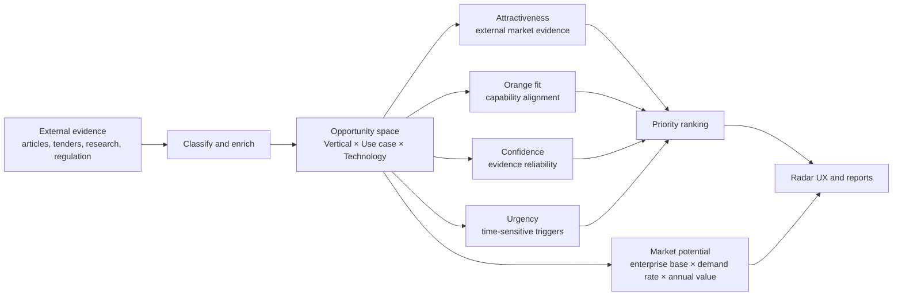

# Initial Presentation — Business Analyst Guide

## Purpose

This document supports the 10-minute Orange Business Innovation Radar pitch.
It explains the complete product story while giving additional depth to Alec's
two main sections: **Uniqueness** and **Business findings**.

The presentation uses results generated by the current analysis pipeline as of
26 August 2026. The figures are evidence-based outputs, not fabricated demo
values.

## One-sentence proposition

> Innovation Radar converts fragmented external evidence into traceable
> opportunity spaces, ranks them according to market evidence and Orange
> Business alignment, and connects them to a controlled market-potential model.

## Central unit of analysis

Every result represents one specific combination:

```text
Opportunity space = Vertical × Use case × Technology
```

Example:

```text
Public/Gov sector × compliance monitoring × cybersecurity platform
```

This is more actionable than a broad trend such as "cybersecurity is growing"
because it identifies the customer context, the business need, and the enabling
technology.

---

## 1. How it works — 3 minutes

### Presentation diagram



### Three-stage explanation

#### Stage 1 — Collect and structure evidence

The pipeline collects external evidence from public and institutional sources,
including procurement notices, EU research sources, company announcements, and
news feeds. Each record retains its title, URL, source, date, classification,
and evidence fields.

#### Stage 2 — Build and assess opportunity spaces

Articles are classified into a vertical, use case, and technology. Eligible
records are grouped into opportunity spaces. The model then calculates four
separate scores:

- **Attractiveness:** strength of external market evidence.
- **Orange fit:** provisional alignment with Orange Business capability groups.
- **Confidence:** reliability and independence of the evidence base.
- **Urgency:** share of evidence containing a near-term trigger.

These become a transparent priority ranking. Opportunities that pass the
minimum evidence and confidence gates enter the Radar; the rest remain visible
on the Watchlist.

#### Stage 3 — Estimate and communicate potential

Market potential is calculated separately from article scoring. Eurostat
enterprise counts and technology-adoption proxies are combined with validated
annual engagement values. Only validated, non-negative EUR estimates can be
shown in the UX. Missing inputs remain explicitly unavailable.

### Suggested 3-minute script

> We start with external evidence rather than a preselected list of fashionable
> technologies. The pipeline preserves the source and classifies each signal
> into a vertical, a concrete use case, and an enabling technology. We then
> aggregate compatible signals into one opportunity space.
>
> We assess that opportunity through four different questions. Is the external
> market attractive? Does it align with capabilities Orange Business could
> plausibly provide? How reliable is the evidence? And is there a near-term
> trigger? Separating these questions matters: a large trend is not necessarily
> right for Orange, and a strong Orange fit is not necessarily supported by
> enough independent evidence.
>
> Finally, we connect the same opportunity-space key to a controlled market-
> potential calculation. The scores tell us what to investigate first; market
> potential tells us the possible annual economic scale. Both feed the radar and
> remain traceable to their inputs.

---

## 2. Uniqueness — 2 minutes — Alec's main section

### The four differentiators

#### 1. It finds actionable intersections, not generic trends

The radar does not stop at labels such as AI, cloud, or cybersecurity. It asks:

```text
In which vertical, for which business problem, enabled by which technology?
```

#### 2. It separates opportunity quality from company fit

Market attractiveness and Orange fit are not blended into one unexplained AI
judgement. Stakeholders can see whether an opportunity is externally strong,
Orange-aligned, urgent, and sufficiently supported.

#### 3. It is explainable by design

The numerical calculations are deterministic. Generative AI can summarize the
evidence and prepare a report, but it does not invent the arithmetic, market
value, or missing evidence. Every score can be traced back to stored records.

#### 4. It is reusable and financially controlled

The same company-profile and opportunity-space model can later be applied to a
competitor or another client. The classification and arithmetic pipeline also
reduces repeated LLM calls, helping control token cost.

### Suggested 2-minute script

> Our uniqueness is not simply collecting more articles. It is the decision
> structure we place around them. Every hypothesis sits at the intersection of
> a vertical, a use case, and a technology, which makes the result specific
> enough for a business conversation.
>
> We also keep external attractiveness separate from Orange fit. This prevents
> us from calling a popular topic an Orange opportunity without showing a
> plausible Orange Business role. Confidence is separate again, so one exciting
> article cannot look as trustworthy as several independent, high-quality
> sources.
>
> Finally, the system is auditable. AI can help interpret text, but deterministic
> code calculates the scores and market potential. If evidence or financial
> assumptions are missing, the system shows the gap instead of inventing a
> number. That makes the method reusable, explainable, and safer for client
> decisions.

### Short uniqueness statement

> We do not rank buzzwords. We rank traceable, Orange-addressable opportunity
> hypotheses and show both their promise and their uncertainty.

---

## 3. Business findings — 2 minutes — Alec's main section

### Verified portfolio results

| Result | Current value | Interpretation |
|---|---:|---|
| Input evidence records | 576 | Records entering automated enrichment/scoring |
| Eligible evidence records | 338 | Records satisfying the scoring conditions |
| Excluded records | 238 | Preserved with reasons rather than silently removed |
| Opportunity spaces | 205 | Distinct vertical × use case × technology combinations |
| Radar spaces | 44 | Passed minimum event, source-independence and confidence gates |
| Watchlist spaces | 161 | Interesting but insufficiently supported for Radar publication |
| Median priority score | 43.2 | Portfolio midpoint, not a probability or percentage return |

### Highest-priority Radar hypotheses

| Opportunity space | Priority | Attractiveness | Orange fit | Confidence | Evidence |
|---|---:|---:|---:|---:|---:|
| Public/Gov sector × compliance monitoring × cybersecurity platform | 81.7 | 76.2 | 100.0 | 89.2 | 7 articles / 5 independent sources |
| Defense × compliance monitoring × cybersecurity platform | 81.1 | 74.8 | 100.0 | 87.3 | 13 articles / 5 independent sources |
| Healthcare × compliance monitoring × cybersecurity platform | 79.7 | 69.9 | 100.0 | 67.2 | 3 articles / 2 independent sources |
| Defense × compliance monitoring × IoT platforms | 74.7 | 64.5 | 100.0 | 70.2 | 3 articles / 2 independent sources |
| Aerospace × asset tracking × autonomous vehicles/drones | 74.1 | 67.9 | 100.0 | 79.9 | 4 articles / 3 independent sources |

### Business interpretation

Three portfolio patterns are visible:

1. **Compliance and cybersecurity recur across regulated verticals.** Public
   sector, defense, healthcare, and financial services all show Radar-level
   combinations around compliance monitoring and cybersecurity platforms.
2. **Operational visibility is the second major cluster.** Asset tracking,
   environmental monitoring, anomaly detection, energy optimization, and
   predictive maintenance frequently combine with IoT and machine learning.
3. **Evidence maturity is uneven.** Only 44 of 205 spaces passed the Radar gate.
   The 161 Watchlist spaces represent a research agenda, not failed ideas.

### Important manufacturing finding

Manufacturing currently contains 12 scored opportunity spaces but none pass the
Radar publication gate. This does **not** prove that manufacturing has no
opportunities. It shows that the current evidence set lacks enough independent,
high-confidence support under the present thresholds. This is a measurable
source-coverage gap and should guide the next collection cycle.

### Suggested 2-minute script

> The current pipeline converted 576 evidence records into 205 distinct
> opportunity spaces. Forty-four passed our minimum Radar gate, while 161 remain
> on the Watchlist. That separation is valuable: we are not forcing every topic
> into a client recommendation.
>
> The strongest repeated pattern is compliance monitoring supported by
> cybersecurity platforms. It appears across public sector, defense, healthcare,
> and financial services. A second cluster concerns operational visibility:
> asset tracking, monitoring, anomaly detection, energy optimization, and
> predictive maintenance, often supported by IoT or machine learning.
>
> We also found a useful gap. Manufacturing has 12 scored spaces, but none yet
> meet the Radar evidence gate. We should not interpret this as no opportunity;
> it means our current source coverage is not strong enough to make a confident
> recommendation. The radar therefore tells us both where evidence is strong and
> where research must improve.

---

## 4. Features and limitations — 3 minutes

### Features available now

- Multi-vertical evidence processing using one configurable pipeline.
- Traceable source records and explicit exclusion reasons.
- Duplicate-resistant aggregation by article, event, and source group.
- Separate attractiveness, Orange-fit, confidence, urgency, and priority scores.
- Radar and Watchlist publication gates.
- Opportunity-level market-size export for the Beta app.
- Europe headline scope with optional regional drill-down.
- Greenfield and expansion/managed-service demand scenarios.
- Low, central, and high annual-potential scenarios.
- Safety rules that suppress negative, invalid, or unapproved EUR values.
- JSON and CSV outputs that can be joined to the UX through the stable taxonomy
  key `vertical|use_case_id|technology_id`.

### Limitations and next steps

| Current limitation | Why it matters | Next step |
|---|---|---|
| Orange fit is provisional | Capability keyword coverage is not proof that Orange will beat competitors | Build an approved capability and credential map |
| Right-to-win is incomplete | Competitive advantage requires internal and competitor evidence | Add references, certifications, reach, differentiation and competitor strength |
| Market size is proxy-based | Eurostat has no precise market category for every emerging technology | Retain proxy labels and triangulate with free public benchmarks |
| Annual engagement values are not yet approved | An unvalidated contract value would create false EUR precision | Validate low/central/high values for selected opportunities |
| Current 205 market-size records are pending/unavailable | Safety gates correctly suppress unsupported financial values | Validate assumptions, rerun 07c–07f, then connect the output to Beta-app |
| Country and adoption coverage varies | Missing public data can bias geographic totals | Display coverage ratios and expand sources selectively |
| Automated relevance remains imperfect | Taxonomy relevance is not identical to Orange addressability | Review strategic samples and measure precision/recall over time |

### Suggested 3-minute script

> The current product already supports multi-vertical processing, traceable
> evidence, separate decision scores, Radar and Watchlist gates, and structured
> exports for the UX. The market-potential pipeline operates at the opportunity-
> space level and can produce a Europe headline plus regional drill-downs.
>
> We have also designed explicit safety gates. A negative value, invalid input,
> unsupported currency, incomplete country coverage, or unapproved annual-value
> assumption cannot silently become a market-size figure.
>
> The most important limitation is language. Orange fit is currently a
> provisional capability-alignment measure; it is not yet a full right-to-win
> score. Right-to-win requires stronger Orange credentials and competitor
> evidence. Market potential is also proxy-based and currently unavailable for
> all 205 spaces because annual engagement-value assumptions have not yet been
> approved. This is controlled incompleteness, not a system error. Our next step
> is to validate a small number of high-priority assumptions before publishing
> EUR figures.

---

## Scoring mechanism for stakeholder questions

### Why there are separate scores

| Measure | Stakeholder question | What it measures | What it does not measure |
|---|---|---|---|
| Attractiveness | Is the external market signalling action? | Signal type, independence, source quality and evidence volume/momentum | Market revenue or Orange capability |
| Orange fit | Could Orange Business plausibly play a role? | Breadth of matched capability groups | Win probability or Orange approval |
| Confidence | How strongly should we trust the result? | Evidence volume, source quality and independence | Commercial value |
| Urgency | Is action time-sensitive? | Share of regulation, buying signals and market moves | Long-term market attractiveness |
| Priority | What should an analyst inspect first? | Weighted synthesis of the four measures | ROI or probability of success |
| Market potential | What might the annual addressable scale be? | Enterprise base, demand scenario and annual engagement value | Guaranteed revenue or market share |

### Attractiveness score

```text
Attractiveness = Signal component
               + Independence component
               + Quality component
               + Momentum/evidence component

Maximum contribution:
Signal       30 points
Independence 25 points
Quality      25 points
Momentum     20 points
Total       100 points
```

Signals such as regulation and buying evidence receive more weight than broad
market trends. Source and event components saturate after documented thresholds
so ten duplicated articles cannot dominate merely through volume.

### Orange-fit score

Current matched capability groups are:

```text
connectivity
cloud and edge
cybersecurity
data and AI
industrial operations
business trigger
```

The implemented MVP formula is:

```text
Orange fit = min(distinct matched capability groups / 4, 1) × 100
```

Four matched groups produce the maximum provisional score. This equal-weighted
rule must later be replaced or calibrated using an Orange-approved capability
map.

### Confidence score

```text
Confidence = evidence-volume component, maximum 35
           + source-quality component, maximum 35
           + source-independence component, maximum 30
```

Confidence protects the ranking from weak evidence. A high-potential idea with
one source should be treated as a hypothesis, not a recommendation.

### Urgency score

```text
Urgent signals = regulation + buying signal + market move

Urgency = urgent evidence records / all evidence records × 100
```

### Priority score

```text
Priority = 40% attractiveness
         + 35% Orange fit
         + 15% confidence
         + 10% urgency
```

These are transparent MVP business weights, not statistically learned causal
coefficients. They should be sensitivity-tested and later approved with Orange
stakeholders.

### Radar publication gate

An opportunity enters the Radar only when it has:

```text
at least 2 independent events
at least 2 independent source groups
confidence score of at least 45
```

Everything else remains traceable on the Watchlist.

---

## Market-potential mechanism

### What the figure means

The result should be described as:

> Estimated annual addressable service potential for this opportunity space
> under stated public-data and annual-value assumptions.

Do not describe it as guaranteed Orange revenue, company valuation, total
industry turnover, or expected market share.

### Public-data inputs

1. Eurostat Structural Business Statistics provide enterprise populations by
   country, NACE activity, and enterprise size.
2. Eurostat ICT indicators provide technology-adoption proxies for AI, cloud,
   cybersecurity, and IoT.
3. Comparable public contracts support low, central, and high annual engagement
   values after currency, duration, and relevance validation.

### Two non-overlapping demand scenarios

For enterprise population `N` and adoption rate `a`:

```text
Greenfield addressable enterprises = N × (1 − a)
Expansion/managed-service enterprises = N × a
```

The first scenario represents potential new adopters. The second represents
existing adopters that may expand, integrate, secure, or outsource the service.

### EUR calculation

```text
Annual market potential = addressable enterprises
                        × validated annual engagement value in EUR
```

The model calculates low, central, and high scenarios instead of presenting
false single-point precision.

### Geography

Calculations begin with country-level public data and aggregate to the configured
European scope. France remains a separate reporting geography because Orange is
headquartered there. The UX headline is the opportunity's Europe-level result;
regions are supporting drill-downs, not separate opportunity definitions.

### Safety and display rules

EUR values are shown only if:

- the vertical maps to a documented NACE activity;
- the technology maps to a documented adoption proxy;
- enterprise and adoption inputs are valid and non-negative;
- low ≤ central ≤ high;
- the values are in EUR;
- the annual-value assumption is approved;
- calculation validation passes.

Otherwise the UX displays an evidence-gap status. The AI report may explain the
status but must not create or calculate a replacement number.

### Current status

All 205 opportunity-space market-size records currently show
`pending_or_unavailable`. The pipeline is functioning correctly; the blocking
condition is the absence of approved annual engagement-value assumptions.

---

## Attractiveness, right-to-win, and market size together

Use this decision interpretation:

| Attractiveness | Right-to-win / fit | Market potential | Decision implication |
|---|---|---|---|
| High | High | High | Candidate for immediate business validation |
| High | Low | High | Attractive market, but partnership or capability gap exists |
| Low | High | High | Orange may fit, but external timing/evidence is weak |
| High | High | Low | Focused niche opportunity; validate profitability rather than scale |
| Unknown | Unknown | Unknown | Research gap; do not recommend yet |

Current Orange fit is one input toward future right-to-win, not its final
replacement:

```text
Future right-to-win = capability fit
                    + credentials and customer references
                    + geographic delivery coverage
                    + partner ecosystem
                    + differentiation
                    − competitor strength
```

---

## Slide-by-slide speaker ownership

| Slide | Section | Time | Suggested lead |
|---:|---|---:|---|
| 1 | Opening proposition | 15 seconds | Team lead |
| 2 | Evidence to opportunity | 1 minute 30 seconds | Technical/product teammate |
| 3 | Scores and market potential | 1 minute 30 seconds | Alec or technical teammate |
| 4 | Uniqueness | 2 minutes | **Alec** |
| 5 | Top Radar findings | 1 minute | **Alec** |
| 6 | Portfolio findings and gaps | 1 minute | **Alec** |
| 7 | Features | 1 minute 30 seconds | Product teammate |
| 8 | Limitations and next steps | 1 minute 30 seconds | Alec or team lead |
| 9 | Live demonstration | Transition | Demo owner |
| 10 | Closing | 15 seconds | Team lead |

---

## Likely stakeholder questions

### “Is 81.7 a probability of success?”

No. It is a normalized priority index created from documented business weights.
It ranks opportunities consistently; it does not predict win probability or ROI.

### “Why is Orange fit not right-to-win?”

Fit shows plausible capability alignment. Right-to-win additionally needs proof
that Orange is differentiated against competitors through credentials, customer
references, geographic reach, partnerships, and delivery strength.

### “Why not let the LLM calculate everything?”

LLMs are useful for extracting and explaining text, but deterministic code is
more reproducible for arithmetic, thresholds, validation, and auditability.

### “Is the market-size figure TAM?”

It is closer to an annual addressable service-potential scenario than a generic
technology-market TAM. It is derived for one vertical/use-case/technology
combination under declared enterprise, adoption, and engagement-value assumptions.

### “Why is market size unavailable right now?”

The data-safety gate requires approved annual engagement values. The model has
enterprise and adoption inputs, but it intentionally suppresses EUR outputs
until the final commercial assumptions are validated.

### “Why does Manufacturing have no Radar opportunity?”

The present corpus produced 12 scored Manufacturing spaces, but none has enough
independent evidence to pass the current gate. This is a source-coverage finding,
not proof that the market lacks opportunities.

### “Can the scores be changed?”

Yes. The weights and thresholds are explicit MVP assumptions. They can be
sensitivity-tested and calibrated with Orange stakeholders without changing the
underlying evidence.

---

## Claims to avoid

Do not say:

- “The score is the probability Orange will win.”
- “Article count proves market size.”
- “The market-size result is guaranteed revenue.”
- “Orange fit has been approved by Orange Business.”
- “All 205 opportunities have validated EUR values.”
- “Manufacturing has no opportunity.”

Prefer:

- “Evidence-based priority index.”
- “Provisional Orange capability alignment.”
- “Estimated annual addressable potential under stated assumptions.”
- “Radar hypothesis requiring business validation.”
- “Watchlist evidence gap.”

