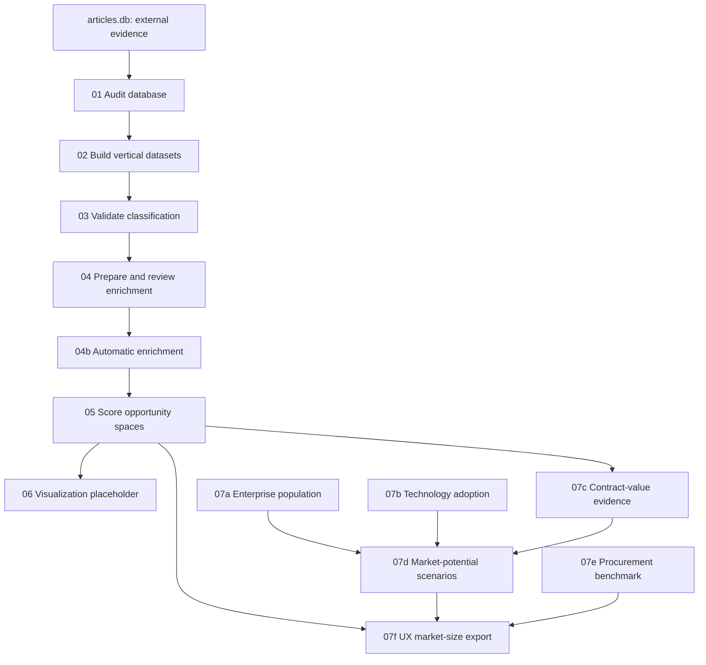

# My Personal Methodology Guide

## Why I created this document

This is my personal guide to the analysis pipeline in the Orange Business
Innovation Radar project. It helps me understand the work, run the files in the
correct order, explain the methodology, and avoid claims that the evidence does
not support.

This is not a polished team handoff or client report. It is my working reference.

---

# 1. What the project is trying to do

The project converts external market information into structured opportunity
hypotheses for Orange Business.

```text
Opportunity space = Vertical × Use case × Technology
```

For example:

```text
Manufacturing × Predictive maintenance × Edge computing
```

- **Vertical:** the customer industry, such as Manufacturing or Finance.
- **Use case:** the business problem or activity, such as predictive maintenance.
- **Technology:** the enabling technology, such as AI, cloud, IoT or edge.

The pipeline does not prove that Orange will win a contract. It identifies and
ranks hypotheses that deserve further investigation.

---

# 2. Complete process



The logic is:

1. Check whether the database is usable.
2. Separate articles by vertical.
3. Test whether existing taxonomy labels are accurate.
4. Enrich candidates with business signals and Orange-related clues.
5. Combine evidence belonging to the same opportunity space.
6. Calculate transparent scores.
7. Attach market potential only when its inputs are valid.
8. Export stable fields for the application.

---

# 3. Important locations

## Main database

```text
BeCode_dataOrange-radar-research-pipeline/data/articles_analysis.db
```

The scripts open it in read-only mode, so analysis should not alter the original
research data.

## Configuration

```text
Analysis/analysis_config.json
Analysis/market_geography_config.json
```

Important current warning: `analysis_config.json` begins with Python-style
assignments before the JSON object. This makes it invalid JSON.
`02_build_dataset.py` uses `json.load()`, so a clean rerun will fail until the
configuration is corrected.

`market_geography_config.json` defines the European country and region scope.
France remains its own geography because it is Orange's home market.

## Outputs

```text
Analysis/outputs/
```

Some scripts overwrite generated results. Others protect files containing
manual review. I should close CSV files in Excel before writing to them because
Excel can cause a `PermissionError` on Windows.

---

# 4. `01_audit_database.py` — Audit the database

## Why I run it

Before analysing anything, I need to know whether the database contains the
expected tables, classifications, dates and verticals. Otherwise later scores
could look precise while being based on incomplete data.

## What it checks

- tables and columns;
- article and classification totals;
- available verticals and classification statuses;
- complete and partial taxonomy combinations;
- confidence and client-relevance coverage;
- sources and publication dates;
- duplicate URLs and orphan classifications;
- ML noise-filter coverage; and
- research-pipeline runs.

It includes a Manufacturing-specific audit because Manufacturing was the first
MVP vertical. The complete project is not restricted to Manufacturing.

## Behaviour and command

It reads SQLite without modifying records and prints its result to the terminal.
The current code does not itself save `database_audit.txt`.

```powershell
& .\.venv\Scripts\python.exe .\Analysis\01_audit_database.py
```

This step is quality control, not opportunity scoring.

---

# 5. `02_build_dataset.py` — Build datasets by vertical

## Purpose

The full database contains many industries. This file produces manageable,
vertical-specific analysis files without creating a separate Python program for
each industry.

## Process

1. Load `analysis_config.json`.
2. Validate requested verticals and source types.
3. Read matching database records.
4. Create one folder per vertical.
5. Write the broad dataset and smaller candidate queue.

## Outputs

```text
Analysis/outputs/<vertical>/articles.csv
Analysis/outputs/<vertical>/candidate_queue.csv
```

The configuration can select one vertical, several verticals or `*` for all
supported verticals.

```powershell
& .\.venv\Scripts\python.exe .\Analysis\02_build_dataset.py
```

A previous Manufacturing run produced 1,463 articles and 124 candidates. Later,
datasets were generated for all available verticals.

The invalid JSON configuration must be repaired before a clean rerun.

---

# 6. `03_validate_classification.py` — Validate taxonomy labels

## Why human validation is necessary

The database assigns vertical, use case and technology labels. I cannot assume
these are correct simply because a model produced them. A human-labelled sample
estimates classification quality.

## Create the sample

```powershell
& .\.venv\Scripts\python.exe .\Analysis\03_validate_classification.py --mode create-sample
```

Output:

```text
Analysis/outputs/validation/validation_sample.csv
```

The fixed random seed makes the stratified sample reproducible. The script
refuses to overwrite an existing sample, protecting human work.

I completed `human_taxonomy_relevance`, recording whether each automated
taxonomy assignment was relevant according to a human reviewer.

## Evaluate the sample

```powershell
& .\.venv\Scripts\python.exe .\Analysis\03_validate_classification.py --mode evaluate
```

```text
Accuracy  = (TP + TN) / (TP + TN + FP + FN)
Precision = TP / (TP + FP)
Recall    = TP / (TP + FN)
F1        = 2 × Precision × Recall / (Precision + Recall)
```

- `TP`: predicted relevant and human says relevant.
- `TN`: predicted irrelevant and human says irrelevant.
- `FP`: predicted relevant but human says irrelevant.
- `FN`: predicted irrelevant but human says relevant.

## Current pilot result

```text
Sample rows: 42
Finalized binary labels used: 25
Accuracy: 92.0%
Relevant precision: 84.6%
Relevant recall: 100.0%
Relevant F1: 91.7%
```

This is encouraging pilot evidence, not proof of 92% accuracy on all future
articles.

Safe wording:

> In a small human-labelled taxonomy pilot, the classifier achieved 92%
> accuracy on the 25 finalized binary cases.

Unsafe wording:

> Our complete radar is 92% accurate.

---

# 7. `04_enrich_candidates.py` — Prepare and review enrichment

## Why enrichment is needed

Taxonomy labels explain an article's topic. They do not automatically show a
buying signal, regulation, proof point or credible Orange Business role.
Enrichment adds those analytical fields.

## Modes

```powershell
& .\.venv\Scripts\python.exe .\Analysis\04_enrich_candidates.py --mode prepare
& .\.venv\Scripts\python.exe .\Analysis\04_enrich_candidates.py --mode enrich-rules
& .\.venv\Scripts\python.exe .\Analysis\04_enrich_candidates.py --mode create-review-template
& .\.venv\Scripts\python.exe .\Analysis\04_enrich_candidates.py --mode import-reviewed --review-file .\Analysis\outputs\enrichment\reviewed_enrichment.csv
& .\.venv\Scripts\python.exe .\Analysis\04_enrich_candidates.py --mode summary
```

The review template defaults to 70 records and refuses to overwrite non-empty
review work.

## Main concepts

Signal types include regulation, buying signal, market move, proof signal,
technology maturity, market trend and unknown.

Orange relevance values are:

- `RELEVANT`: a credible Orange-addressable role exists;
- `IRRELEVANT`: no credible role is present;
- `REVIEW`: the evidence remains genuinely uncertain.

Orange-fit basis values are:

- `explicit`: directly stated by the evidence;
- `inferred`: plausible but not directly stated;
- `unsupported`: insufficient evidence.

## Source-quality priors

```text
TED/OCDS procurement: 0.90
CORDIS research:      0.80
RSS:                  0.55
GNews:                0.45
Default:              0.30
```

These are analyst-defined weights, not measured probabilities of truth.

## Critical connection problem

Manual review is not yet safely connected to scoring.
`04b_auto_enrich_candidates.py` reads `enriched_candidates.csv` and overwrites
several enrichment decisions. `05_score_opportunities.py` then reads
`auto_scoring_candidates.csv`.

Therefore, completing `reviewed_enrichment.csv` does not automatically mean the
human decisions are used by scoring. This lineage issue must be fixed before I
claim that the score is based on human-reviewed enrichment.

---

# 8. `04b_auto_enrich_candidates.py` — Automatic enrichment

## Purpose

This no-API, no-LLM method avoids manually reading every candidate. It uses
transparent keyword rules, reducing token consumption and making results
reproducible.

Positive groups include connectivity, cloud/edge, cybersecurity, data/AI,
industrial operations and business triggers. Negative groups include
commodity-only incidents, biomedical/ecology, and consumer/political topics.

The script combines title, summary and text, detects groups, assigns a signal
type and creates automatic relevance fields.

Output:

```text
Analysis/outputs/enrichment/auto_scoring_candidates.csv
```

Benefit: fast, inexpensive and explainable.

Limitation: keyword matching can miss synonyms, misunderstand negation or count
contextual terms as capabilities. It is triage, not ground truth.

---

# 9. `05_score_opportunities.py` — Score opportunities

## Unit of analysis

The script groups eligible evidence by:

```text
vertical + use_case_id + technology_id
```

Each group is one opportunity hypothesis. Incomplete records are written to an
exclusions file rather than silently entering the score.

## Signal points

```text
regulation            = 4
buying_signal         = 4
market_move           = 3
proof_signal          = 3
technology_maturity   = 2
market_trend          = 2
unknown               = 1
```

Urgent signals are regulation, buying signal and market move.

## Attractiveness

```text
Attractiveness =
min(mean signal points / 4, 1) × 30
+ min(distinct source names / 3, 1) × 25
+ mean source-quality prior × 25
+ min(distinct event keys / 5, 1) × 20
```

It is a `0–100` external-evidence index. Strong signals, more source names,
higher source priors and more event keys increase it. It is not measured market
demand, revenue or growth.

The code calls the final term “momentum,” but it counts distinct event keys; it
does not measure change over time.

## Orange fit

```text
Orange fit = min(distinct automatic positive groups / 4, 1) × 100
```

This is keyword-group breadth. Because business triggers and industrial context
are counted alongside capabilities, it is not a probability that Orange will
win.

## Confidence

```text
Confidence =
min(evidence count / 5, 1) × 35
+ mean source-quality prior × 35
+ min(distinct source names / 3, 1) × 30
```

This measures evidence volume, source priors and distinct source names. A source
name does not guarantee independent ownership, and this score reuses factors
already included in attractiveness.

## Urgency

```text
Urgency = urgent-signal records / all eligible records × 100
```

This is more accurately a near-term-trigger share. It does not measure days to
a deadline.

## Priority

```text
Priority =
0.40 × Attractiveness
+ 0.35 × Orange fit
+ 0.15 × Confidence
+ 0.10 × Urgency
```

The weights represent business preferences. They were not fitted against past
Orange sales outcomes.

Example:

```text
Attractiveness = 70
Orange fit     = 80
Confidence     = 60
Urgency        = 50

Priority = 0.40(70) + 0.35(80) + 0.15(60) + 0.10(50)
         = 28 + 28 + 9 + 5
         = 70
```

This ranks strongly under the chosen rules. It does not imply a 70% chance of
success.

## Radar gate

```text
distinct event keys >= 2
distinct source names >= 2
confidence >= 45
```

Passing all three creates `RADAR`; otherwise the hypothesis stays on the
`WATCHLIST`. Watchlist means “needs stronger evidence,” not “irrelevant.”

## Outputs and current result

```text
opportunity_scores.csv
opportunity_evidence.csv
watchlist.csv
scoring_exclusions.csv
scoring_summary.csv
```

```text
Input records:              576
Eligible evidence:          338
Excluded records:           238
Opportunity spaces:         205
Radar spaces:                44
Watchlist spaces:           161
Median priority:           43.2
```

I cannot claim that the score predicts revenue, that 80 means an 80% chance of
winning, or that the weights are statistically optimized.

---

# 10. `06_visualize_results.py` — Visualization

This file is currently empty. It does not generate a chart or dashboard. The
Beta application may provide the final interface, but this Python file remains
only a placeholder.

---

# 11. `market_geography.py` — Shared geography

This helper loads the geography configuration and supplies consistent country
codes, region names, labels and scope to the market-size scripts. It also checks
for duplicate country assignments.

Using one geography definition prevents scripts from producing incomparable
European totals.

---

# 12. `07a_prepare_eurostat_sbs.py` — Enterprise population

## Why it is needed

Market potential requires a customer denominator: how many target enterprises
exist in the chosen countries, sectors and company-size classes?

The four Eurostat sources are:

- `sbs_sc_ovw`: primary enterprise counts by size and NACE;
- `sbs_ovw_smc`: extended size classes;
- `sbs_ovw_act`: detailed NACE validation;
- `sbs_ovw_iep`: investment context, not the market-size total.

## Normalization

The raw TSV combines dimensions in its first column and places years across
columns. The script separates dimensions, cleans Eurostat flags, converts values
to numbers, filters the required scope, and writes normalized long-form CSVs.

The main denominator currently uses:

```text
Year: 2024
Measure: ENT_NR
Company sizes: 50–249 and 250+
```

Medium and large companies are used because they are more plausible customers
for substantial Orange Business services.

Implemented vertical mappings are:

```text
Manufacturing -> NACE C
Automotive    -> NACE C29
```

`C29` is contained within `C`, so adding them together would double-count
Automotive.

---

# 13. `07b_prepare_eurostat_ict_adoption.py` — Technology adoption

Enterprise counts alone overstate an opportunity. Adoption divides the base
between existing technology users and non-users.

```text
AI            -> E_AI_TANY, 2025
Cloud         -> E_CC1_SI, 2025
Cybersecurity -> E_SECMGE1, 2024
IoT           -> E_IOT1, 2021
Unit          -> PC_ENT
```

If enterprise count is `N` and adoption proportion is `a`:

```text
Existing adopters = N × a
Non-adopters      = N × (1 - a)
```

Existing adopters support expansion or managed-service scenarios. Non-adopters
support greenfield adoption scenarios.

The rate is often an all-business proxy rather than a precise vertical rate.
Some metadata says “Manufacturing proxy” even when applied to Automotive; that
wording should be corrected.

---

# 14. `07c_prepare_comparable_contract_values.py` — Annual values

To express potential in euros, the model needs a defensible annual value per
enterprise engagement.

The script searches comparable awarded procurement values and calculates:

```text
Low     = 25th percentile
Central = median
High    = 75th percentile
```

Percentiles are more robust than the mean when a few unusually large contracts
make the distribution highly skewed.

Safeguards include:

- at least five award observations;
- award notice types beginning `can-`;
- no assumed EUR currency without evidence;
- no conversion from total to annual value without duration evidence; and
- human approval before publication.

Current data has not produced sufficient approved annual values. Therefore, no
validated EUR market headline is available. This is a data-validation status,
not a program crash.

---

# 15. `07d_calculate_market_potential.py` — Market potential

This calculates scenario-based annual addressable potential. It is not total
sector revenue and not an Orange sales forecast.

```text
N = target enterprise count
a = technology adoption percentage / 100

Greenfield enterprises = N × (1 - a)
Expansion enterprises  = N × a

Potential_low     = addressable enterprises × annual value_low
Potential_central = addressable enterprises × annual value_central
Potential_high    = addressable enterprises × annual value_high
```

Example only:

```text
N = 1,000
a = 40%
Annual values = EUR 50k / 75k / 100k

Greenfield enterprises = 1,000 × 60% = 600
Potential = EUR 30m / EUR 45m / EUR 60m
```

This example explains the mechanism; it is not a current Orange result.

Validation checks include:

- non-negative enterprise counts;
- adoption between 0 and 1;
- low <= central <= high;
- explicit EUR currency;
- approved annual values; and
- valid vertical and technology mappings.

If validation fails, the EUR value is cleared instead of displaying a false or
negative number.

Country and region results are drill-down context. The preferred UX headline is
the Europe-wide value for the opportunity space.

---

# 16. `07e_calculate_procurement_benchmark.py` — Procurement context

This examines recent notices and awards, observation counts and raw value
percentiles. The current recency window is 730 days.

A procurement benchmark is not automatically market size: notices can cover
multiple years, currencies and products, and the database may not represent the
entire market. It remains supporting evidence unless scope, currency and period
are validated.

---

# 17. `07f_build_opportunity_market_size_export.py` — UX export

The application needs a stable key connecting each radar opportunity with its
market-size record:

```text
vertical|use_case_id|technology_id
```

The export combines identifiers, Europe totals, regional details, methodology
status and evidence metadata.

Display statuses:

- `estimated`: both greenfield and expansion segments are valid;
- `partial`: only one segment is valid and must be labelled incomplete;
- `pending/unavailable`: required inputs are missing or invalid.

For pending records, the UX should show:

```text
Market estimate pending validation
```

An AI report must use the status and must not invent a number.

All current 205 opportunity-space records are pending or unavailable because
approved annual engagement values are missing.

---

# 18. Correct run order

## Opportunity scoring

```text
01_audit_database.py
→ 02_build_dataset.py
→ 03_validate_classification.py --mode create-sample
→ human taxonomy review
→ 03_validate_classification.py --mode evaluate
→ 04_enrich_candidates.py
→ 04b_auto_enrich_candidates.py
→ 05_score_opportunities.py
```

## Market potential

```text
07a_prepare_eurostat_sbs.py
→ 07b_prepare_eurostat_ict_adoption.py
→ 07c_prepare_comparable_contract_values.py
→ 07d_calculate_market_potential.py
→ 07e_calculate_procurement_benchmark.py
→ 07f_build_opportunity_market_size_export.py
```

The market-size pipeline uses opportunity identifiers produced by scoring.

---

# 19. What still needs human judgement

Automation reduces reading, but it does not remove human responsibility.

I still need humans to:

- validate a representative taxonomy sample;
- review ambiguous enrichment results;
- confirm genuine Orange-addressable capabilities;
- investigate whether sources are actually independent;
- approve annual engagement values;
- validate NACE and technology mappings;
- review top-ranked opportunities; and
- approve stakeholder wording.

The efficient approach is to review a representative sample, ambiguous cases
and top-opportunity evidence—not every article.

---

# 20. Statistical meaning

Attractiveness, Orange fit, confidence, urgency and priority are constructed
indices. A score of 70 does not mean 70 euros, 70% growth or a 70% success
probability.

Normalization places components on a common `0–100` scale so they can be ranked.
Caps such as `min(source count / 3, 1)` stop a huge article count from dominating
the score. Scenario ranges avoid false precision in financial estimates.

---

# 21. Limitations I must remember

1. Taxonomy validation is a small pilot.
2. Automatic enrichment can misunderstand context.
3. Human-reviewed enrichment is not safely connected to scoring.
4. “Momentum” is event-key count, not temporal growth.
5. Event independence mainly uses URL uniqueness.
6. Source independence uses source-name count, not ownership analysis.
7. Orange fit includes contextual groups, not only capabilities.
8. Confidence duplicates factors used in attractiveness.
9. Urgency is trigger share, not deadline proximity.
10. Weights and thresholds are assumptions, not fitted models.
11. Market-size mapping covers only Manufacturing and Automotive.
12. ICT adoption often uses broad proxies.
13. Annual engagement values are not yet approved.
14. No validated EUR headline is currently available.
15. `06_visualize_results.py` is empty.
16. `analysis_config.json` is currently invalid JSON.

---

# 22. How I explain the uniqueness

The project does more than collect trends:

- it defines opportunities as vertical × use case × technology;
- it preserves evidence behind every hypothesis;
- it separates Radar and Watchlist using explicit gates;
- it combines external evidence with provisional Orange alignment;
- it uses public data for reproducible financial scenarios;
- it suppresses invalid financial values; and
- it exports stable records for an interactive app and AI reports.

---

# 23. Presentation answers

## Thirty-second methodology

> We classify external signals by industry, business use case and enabling
> technology. We aggregate related evidence into opportunity hypotheses and
> rank them using transparent evidence-strength, Orange-fit, confidence and
> trigger indices. A hypothesis only enters the Radar when it passes minimum
> evidence gates; otherwise it remains on the Watchlist. Where validated public
> inputs exist, we attach scenario-based annual market potential instead of
> inventing a market figure.

## Where do the numbers come from?

> Score inputs come from signal types, source counts, source priors, evidence
> counts and Orange-related keyword groups. Enterprise counts and technology
> adoption come from Eurostat. Euro values require approved annual engagement
> evidence.

## Does the model predict sales?

> No. It is a transparent prioritization model that identifies hypotheses for
> investigation. Commercial validation and Orange expert review remain needed.

## Why is a market value missing?

> The model suppresses the number when the enterprise base, adoption proxy or
> annual value is not validated. Missing is more honest than false precision.

---

# 24. My checklist

## Before running

- [ ] Activate the virtual environment.
- [ ] Confirm the database exists.
- [ ] Confirm `analysis_config.json` is valid.
- [ ] Close output CSVs in Excel.
- [ ] Back up manual-review work.
- [ ] Check Git branch and changes.

## Scoring

- [ ] Audit the database.
- [ ] Build vertical datasets.
- [ ] Complete and evaluate the validation sample.
- [ ] Prepare and run enrichment.
- [ ] Verify which enrichment file scoring reads.
- [ ] Run scoring.
- [ ] Review exclusions and Watchlist reasons.
- [ ] Inspect evidence for top opportunities.

## Market potential

- [ ] Prepare Eurostat enterprise data.
- [ ] Inspect missing NACE/country observations.
- [ ] Prepare adoption indicators.
- [ ] Validate technology mappings.
- [ ] Validate annual engagement values.
- [ ] Calculate scenarios.
- [ ] Confirm non-negative values and low <= central <= high.
- [ ] Build the UX export.
- [ ] Confirm pending records show no invented EUR value.

## Before presenting

- [ ] State geography, company size and observation period.
- [ ] Label measured, proxy-based and assumed inputs.
- [ ] Distinguish Radar from Watchlist.
- [ ] Do not present scores as probabilities.
- [ ] Do not present market potential as Orange revenue.
- [ ] Keep evidence links available.

---

# 25. My current progress

## Completed

- Database audited.
- All vertical datasets generated.
- Human taxonomy sample reviewed.
- Pilot validation metrics calculated.
- Automatic enrichment created.
- 205 opportunity spaces scored.
- Radar and Watchlist separated.
- Eurostat preparation scripts created.
- Market-potential and UX-export scripts created.

## Still unresolved

- Repair invalid JSON configuration.
- Connect reviewed enrichment safely to scoring.
- Improve event and source independence.
- Separate capabilities from contextual keywords.
- Validate weights with stakeholders.
- Map additional verticals.
- Approve annual engagement values.
- Produce the first defensible EUR opportunity estimate.
- Integrate the export into the Beta app.
- Implement or remove the empty visualization file.

---

# 26. My source-of-truth rule

When I am confused, I check information in this order:

```text
Current executable Python code
→ generated outputs
→ configuration and reference files
→ this personal guide
→ presentation wording
```

If presentation wording is unsupported by the code and outputs, I correct the
presentation. If I change a formula, I rerun the pipeline and update this guide.
